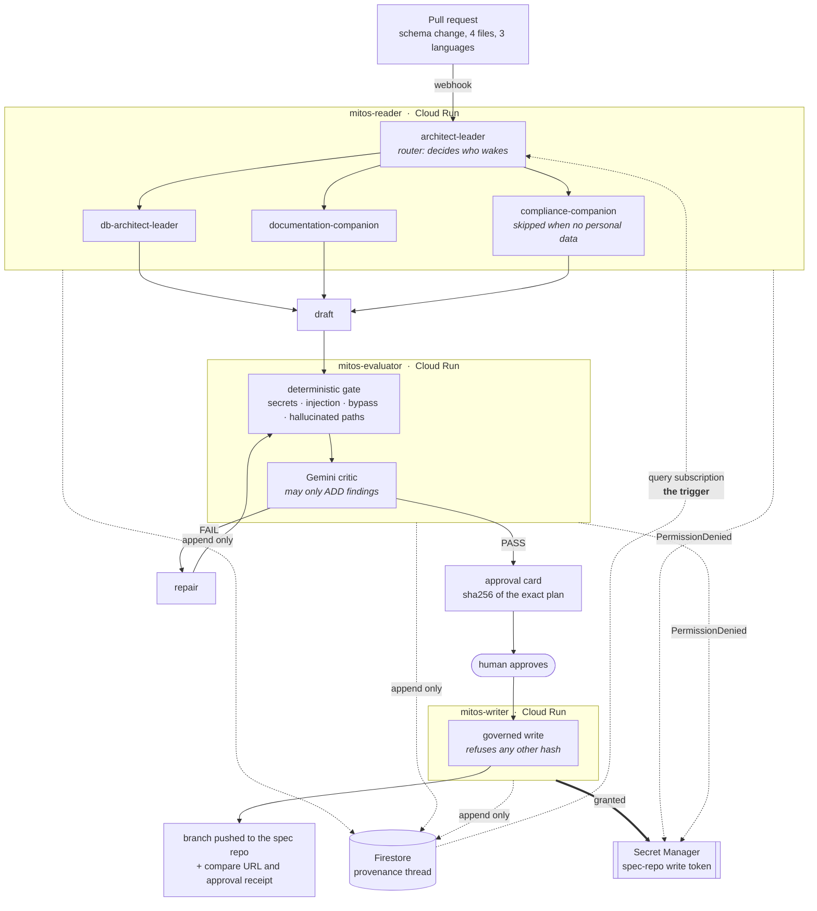
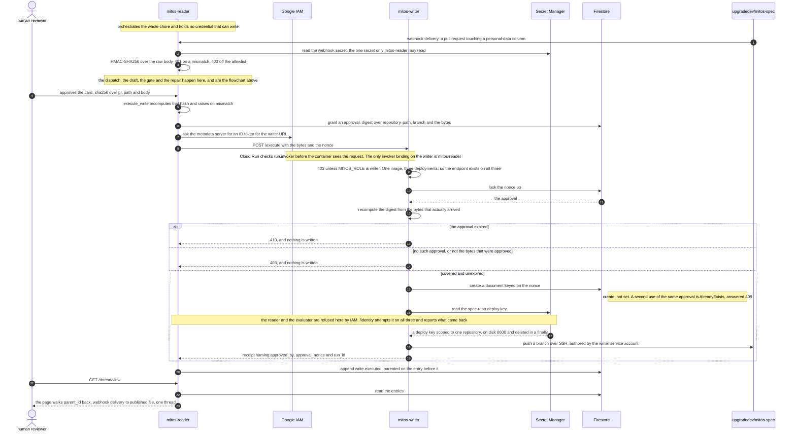

# Mitos

[](https://github.com/upgradedev/mitos-gcp/actions/workflows/ci.yml)
[](https://github.com/upgradedev/mitos-gcp/actions/workflows/video.yml)
[](https://github.com/upgradedev/mitos-gcp/actions/runs/32756367127)
[](https://cloud.google.com/vertex-ai)
[](https://console.cloud.google.com/run?project=upgradegr-mitos)
[](https://www.python.org/)
[](LICENSE)

**A schema change ships on Tuesday. In March, a regulator asks who approved the mobile-number
column and why. Mitos is the fleet that answers that, and the thread you follow back.**

**▶ Demo video:** `PENDING_YOUTUBE_UPLOAD`
*(the master is 210.10s, built and verified in CI by
[run 32749633575](https://github.com/upgradedev/mitos-gcp/actions/runs/32749633575), which asserts
on the shipped pixels rather than on the inputs. This line is replaced with the public URL at
upload, and every CI run annotates a warning while the placeholder is still here so it cannot be
quietly forgotten.)*

Named for Ariadne's thread. You can always retrace your way out.

Built for **All Things Agentic (Google)**, track **The Fortified Enterprise Fleet**.

## Who this is for

The engineering lead at a **regulated European electricity distribution operator**. Every schema
change that touches a customer field drags four things behind it: a specification that silently goes
stale, a record of processing under GDPR Article 30, a retention entry, and an owner who has to be
told. Today one person chases all four by hand after the fact, and finds out they missed one when
someone external asks.

Mitos does that chase unattended and returns **one diff to approve**.

## Why this is worse than it was

The number of changes is rising sharply, because models write them now. The work
that hangs off a change did not scale with it. Somebody who chased four
specification updates and four retention entries a week does not chase forty.
They stop, and nobody decides to stop, so nobody notices.

Mitos governs a change whoever or whatever wrote it. It does not detect that a
change came from a model and it does not supervise anybody's agents. What it
does is keep the paperwork attached to the code at the speed the code now moves.

The same discipline is turned on Mitos itself, which is the part worth checking
rather than believing: its guard refuses its own agent at the tool call, its
model may add findings and never remove one, and its single write needs a human
and is bound to exact bytes.

## The one thing it does

A pull request lands carrying a schema change on a field that holds personal data. Nobody opens
Mitos; a webhook starts it. The fleet works out which specialists the change concerns, remembers what
it already decided about that service weeks ago, has its first draft **rejected by its own gate**,
repairs it, and comes back with a single content-addressed diff for a human.

Everything before the approval is autonomous. The approval is the last step, not a stall in the
middle.



**What the last box is, exactly.** The writer pushes a branch to the specification repository and returns a compare URL and a receipt naming the approval that authorised it. It does **not** open a pull request on the code repository and it does **not** post a status check, and `open_pull_request` and `set_commit_status` remain names in the guard's deny list that nothing may call.

This paragraph used to end by saying nothing in the repository had ever called a GitHub write endpoint. That stopped being true one day after it was written. `service/main.py` creates and updates a check run (`POST` and `PATCH /check-runs`) and, behind an approval, creates a branch, writes a file and opens a pull request (`POST /git/refs`, `PUT /contents/{path}`, `POST /pulls`) — five calls across four endpoints, reached from the webhook handler and from `POST /api/workspace/suggested-changes/approve`. They run under a GitHub App installation token, not under the deploy key, so the sentence that still holds is the narrow one: the writer's credential cannot touch anybody else's repository. The sweeping one did not.

None of it has executed against a real repository yet, because no GitHub App is installed. Saying "we do not do this" was easier to check and easier to trust than saying "we do this, under an approval, untested" — which is why the false version survived for weeks, and why it is worth naming rather than quietly editing.

The two dotted red-herring arrows into Secret Manager are the point of the whole design. The reader
and the evaluator **ask** for the write credential and Google IAM refuses them. Nothing in our code
decides that.

## Why Google Cloud is load-bearing

> **Mitos has no scheduler and no queue. Its agents hold open Firestore query subscriptions, so
> when any deferral is written or changed the fleet is handed the whole open set and escalates the
> ones that have expired, unattended. Take Firestore away and the thread you follow back stops
> being the control plane and becomes a log, and you need a queue, a poller and a separate state
> store to get the same behaviour, none of which can be retraced as one thread.**

**What that does not do, said plainly.** The calendar alone does not wake anything. The query is
`kind == "finding.deferred"` with no date in it, so a deferral reaching its expiry writes nothing,
changes no result set, and produces no snapshot. The expiry is evaluated in the callback, so an
expired deferral is noticed the next time the set changes for any reason. This README said
"deferred until 12 August wakes the fleet on 12 August" and that was not true. Making it true
needs a durable timer, a Cloud Task scheduled at the expiry with an authenticated idempotent
callback, which is a real subsystem and is not in this build.

A change feed is not the same thing. DynamoDB Streams is shard-ordered, consumed server-side, and
delivers events about a *table*. `on_snapshot` subscribes to a **query**: *every finding whose
deferral is still open*. The process holding it is handed the current result set and then every
change to it, so "wake me when this set changes" needs no poller, no queue, and no second store to
remember what was already seen.

The consequence is architectural rather than cosmetic. **The provenance thread stops being a log and
becomes the thing that dispatches work.** One store is the memory, the audit trail and the control
plane at once, which is why a run can be retraced as a single thread instead of reconciled across
three systems. It is also what makes the track's hardest phrase mechanical, with one honest limit: a deferral
until 12 August is a standing query, and the fleet wakes when that query's result set changes with
nobody scheduling anything. The date moving past on its own delivers no snapshot, which is stated
in full above.

Watch it, with no account. `wakeups` only increments when Firestore delivered a snapshot in which a
deferral had expired:

```bash
curl -s https://mitos-reader-437828525303.europe-west1.run.app/watch
```

Cloud Run throttles CPU to zero between requests by default, which would suspend a subscription
silently. The reader is deployed with `--no-cpu-throttling` for exactly that reason. A listener that
only runs while someone happens to be calling you is a poller with extra steps.

### And the privilege boundary underneath it

> Mitos runs its reader, its evaluator and its writer as three Cloud Run services under three
> separate service accounts, and enforces every gate decision inside ADK's tool-call interceptor
> rather than in a prompt, so the identity that reads production data holds no credential that can
> write it and no agent in the fleet can talk its way past the gate.

**Open the thread.** The product is named for a thread you can follow back, so it
is drawn rather than listed. Click any outcome and the whole path to the pull
request that caused it lights up:

**https://mitos-reader-437828525303.europe-west1.run.app/thread/view**

Check it yourself, with no account:

```bash
curl -s https://mitos-reader-437828525303.europe-west1.run.app/identity
```

That is one command rather than two on purpose. This used to print a second curl
against the writer, and anyone who ran it got a Google 403 HTML page, because the
writer and the evaluator refuse anonymous callers — only the reader's service
account may invoke them. That refusal is the architecture working, and
`deployed.yml` fails the build if either of them ever answers a stranger, so the
instruction was wrong rather than the deployment.

The reader's own answer carries the whole point anyway. It reports what it may
call and what it can reach, and the second line is not its opinion:

| Identity | may call `write_spec_repo` | reaches the write credential | answers a stranger |
|---|---|---|---|
| `mitos-reader` | `false` | **PermissionDenied**, from IAM | yes, 200 |
| `mitos-evaluator` | `false` | **PermissionDenied**, from IAM | no, 403 |
| `mitos-writer` | `true` | yes | no, 403 |

The credential is an **SSH deploy key scoped to a single repository**, not a personal access token.
A token would carry the whole account. This carries write access to `mitos-spec` and nothing else,
which is the difference between saying least privilege and doing it.

So the boundary has a consequence rather than being a demonstration. Ask the reader to write and it
refuses, because it has nothing to write with:

```bash
curl -s -X POST https://mitos-reader-437828525303.europe-west1.run.app/execute \
  -H 'content-type: application/json' \
  -d '{"path":"docs/x.md","body":"x","message":"m","branch":"b"}'
# {"detail":"the reader service holds no credential that can write"}
```

The reader orchestrates the whole chore and then has to **ask** the writer service, over an
authenticated call, and the writer verifies an approval artifact before it publishes anything.
The approval binds the repository, the path, the branch and a digest of the exact bytes, plus the
run, the approving actor, an expiry and a nonce. The writer recomputes that digest from the bytes
it was handed, so a caller who changes one character after approval is refused, and the nonce is
consumed with a Firestore `create` so the same approval cannot be replayed into a second write.

This said the writer re-checked the plan hash long before it did. It does now, and every refusal
has a test that feeds it the input that would previously have got through.

**The same write, in the order it happens.** The picture at the top of this README shows who talks
to whom. This one shows what has to be true at each step and who does the refusing, which is the
part boxes cannot carry: two hash checks over different fields on either side of the boundary, and
two refusals that are Google's rather than ours.



**On the public deployment this stops early, and that is deliberate.** `_publisher` in
[`service/main.py`](service/main.py) hands back nothing unless `MITOS_PUBLIC_DEMO_MAY_WRITE` is
`yes`, and [`infra/main.tf`](infra/main.tf) does not set it on the reader. So a run an anonymous
caller starts gets as far as the card and the hash check and asks nobody to write. An
unauthenticated request that can end in a publish is the shape of the hole this replaced.

`/identity` does not read a config flag. It **attempts** the access and reports what came back.

### The interceptor, and the proof it can fail

The refusal happens in ADK's dispatcher, not in a system prompt. In
`google/adk/flows/llm_flows/functions.py` the dispatcher runs every registered callback and invokes
the tool only when the collected response `is None`, so a non-empty dict from
[`src/mitos/guard.py`](src/mitos/guard.py) means the tool is never called.

| Run | Result | What it establishes |
|---|---|---|
| [32234664424](https://github.com/upgradedev/mitos-gcp/actions/runs/32234664424) | 3 passed | a stub model demanding the write never reaches the tool as reader, and **does** reach it as writer, so the harness genuinely dispatches |
| [32234805908](https://github.com/upgradedev/mitos-gcp/actions/runs/32234805908) | 1 failed | **proof the gate has teeth.** Guard disabled by one edit; the same model then wrote `docs/customer.md` |
| local, 2026-08-19 | 6 passed | the same block against **live Gemini 3.7**, not a stub. `tests/integration/test_gemini_live.py` |

A gate nobody has watched go red is a gate nobody should believe.

### Is this actually agentic, or a rules engine with a model attached

A fair question, and for most of this project's life the honest answer was the
second one. Every outcome was decided by a regular expression; the model wrote
prose. Deleting it would have changed nothing.

**A specialist now gets a repository and a question instead of an answer, and
decides what to open.** The choice is real and it differs per item:

```
PR 4473  list_paths(*)  search(supply)  read_file(registers/retention.md)
         read_file(docs/specs/customer-record.md)  ...          -> ok
PR 4477  list_paths(*)  search(vulnerability)  read_file(registers/retention.md)
         read_file(docs/specs/customer-record.md)               -> blocked
```

That sequence is recorded in the provenance thread, so the agency is inspectable
rather than claimed. A fixed pipeline produces the same log on every item.

**The case that settles it.** `PR 4483` adds a column called `vuln_code`. No
pattern matches it, and only a comment says it holds medical dependency data
from a questionnaire.

| | compliance woken | outcome |
|---|---|---|
| deterministic rules alone | **no** | **completed**, and health data ships |
| with the model reading the repository | yes | **blocked**, citing the register it opened |

Both halves are pinned by tests. [`test_rules_alone_are_not_enough.py`](tests/unit/test_rules_alone_are_not_enough.py)
asserts the rules miss it and needs no credential;
[`test_gemini_live.py`](tests/integration/test_gemini_live.py) asserts the model
catches it. If either stops being true, the build says so.

### Bounded reads, which is why the guard is not decoration

An agent that genuinely decides where to look can decide to look somewhere it
should not. So the reads are bounded in [`src/mitos/tools.py`](src/mitos/tools.py)
and enforced in the interceptor, not requested in a prompt:

| Bound | What it refuses |
|---|---|
| scope | anything outside `docs/`, `services/`, `registers/` |
| traversal | `..` and absolute paths |
| size | a single read is capped |
| budget | a finite number of successful reads per run |

A refused read does not consume the budget, so an agent that guesses a path
badly is not locked out of files it is entitled to open. That distinction was a
real bug: counting refusals inflated the number past the cap, so the limit never
stopped anything.

### Why a model is allowed near the gate

The evaluator is deterministic. A Gemini critic sits behind it and **can only add findings**.
`_with_critic` in [`src/mitos/evaluator.py`](src/mitos/evaluator.py) computes
`passed = deterministic_passed AND the critic found nothing`; there is no branch that removes a
finding or flips a verdict. [`tests/unit/test_critic_invariant.py`](tests/unit/test_critic_invariant.py)
feeds it a critic that insists everything is approved and asserts the deterministic findings survive.

A gate a model can argue its way out of is not a gate, and the model reviewing the draft is the same
class of thing that wrote it.

## What the track asked for

| Track wording | Where it is |
|---|---|
| "cataloged for cross-department use" | the catalogue is a queried structure, not a table in a document. The router reads it to decide who wakes, so adding a companion changes behaviour. `GET /catalog` |
| "safely maintain context across weeks of asynchronous operations" | **the query subscription is the mechanism, not the storage.** Writing or changing any deferral hands the fleet the whole open set and it escalates the expired ones with nobody scheduling anything. The calendar alone delivers no snapshot. `GET /watch` counts the wakes. The demo also runs the chore twice and the second run recalls what the first wrote, live |
| "without violating enterprise compliance, data sovereignty, or security policies" | three identities, one write credential, an append-only ledger with no mutation method, and a write addressed by sha256 |

## Run it

**Nothing to install.** It is deployed, and these are live right now:

| | |
|---|---|
| **Watch the thread** | https://mitos-reader-437828525303.europe-west1.run.app/thread/view |
| Who each service is, and what it cannot reach | [`/identity`](https://mitos-reader-437828525303.europe-west1.run.app/identity) |
| The subscription, and how many times it woke | [`/watch`](https://mitos-reader-437828525303.europe-west1.run.app/watch) |
| The catalogue the router queries | [`/catalog`](https://mitos-reader-437828525303.europe-west1.run.app/catalog) |
| The API | [`/openapi.json`](https://mitos-reader-437828525303.europe-west1.run.app/openapi.json) |

**Watch the chore happen.** It streams, so the first beat arrives in under a
second even though the whole thing takes a minute or two with a model reading the
repository:

```bash
curl -N -X POST https://mitos-reader-437828525303.europe-west1.run.app/run/stream   -H 'content-type: application/json' -d '{"pr":4471,"seed":true}'
```

**Ask the reader to write, and watch it refuse:**

```bash
curl -s -X POST https://mitos-reader-437828525303.europe-west1.run.app/execute   -H 'content-type: application/json'   -d '{"path":"docs/x.md","body":"x","message":"m","branch":"b"}'
# {"detail":"the reader service holds no credential that can write"}
```

### From source, against the same stack

```bash
pip install -r requirements/spike.txt
export GOOGLE_CLOUD_PROJECT=upgradegr-mitos MITOS_MODEL=gemini-3.7-flash
PYTHONPATH=src python -m mitos.demo
```

The default is Firestore and Gemini, deliberately. If it cannot reach them it
prints **THIS IS NOT THE REAL SYSTEM** in red and points back at the deployed
URL, because a demo that quietly falls back to an in-memory ledger shows a stub
and nobody watching can tell.

`--ledger memory` exists for CI, where a test suite must not need a cloud
account. It announces itself on screen.

Python 3.10+; CI runs 3.13.

### Point it at your own repository

The specialists read the repository the change came from, not a fixture. Add the
repository to the allowlist, put a webhook on it, and they read your code:

```bash
export MITOS_WEBHOOK_REPOS=your-org/your-repo
export MITOS_READ_SCOPE=docs/,src/,registers/     # your layout, not ours
```

**Verified against a real, unrelated repository.** Pointed at
[upgradedev/archon-gcp-agentic](https://github.com/upgradedev/archon-gcp-agentic),
which shares no code and no conventions with this one, the documentation
companion listed 28 files, chose to `search(AnalysisRecord)`, opened
`src/archon/domain/models.py`, and reported:

> The target class `AnalysisRecord` does not exist in `src/archon/domain/models.py`.

That is a true statement about somebody else's code, arrived at by an agent that
decided where to look. It is not reachable from a fixture.

**Two honest limits.** Reads use the public GitHub API with no credential,
deliberately, because a read path that needs a token is a read path that can be
used to write. So **private repositories are not supported yet**. And there is
**no Azure DevOps adapter**; the corpus is a protocol with two implementations,
so it is an adapter's worth of work rather than a redesign, but it is not
written.

**Gemini 3.x is served on Vertex's `global` endpoint, not the regional ones.**
Every regional endpoint returns 404 for a 3.x model id while serving 2.5 happily.
That cost an hour to find and `test_gemini_live.py` pins it.

## Tests

| Layer | What it covers |
|---|---|
| `tests/unit` | the policy, the ledger contract, every detector, the critic invariant |
| `tests/integration` | the chore end to end, the ADK dispatcher, Firestore against the emulator, live Gemini |
| `tests/e2e` | the journey a judge watches, driven the way this README says to run it |

**86% coverage against an 85% floor**, measured on `main` by
[CI run 32738967814](https://github.com/upgradedev/mitos-gcp/actions/runs/32756367127):
86.20%, 2725 statements, 376 missed. The command that produced it, and the whole
of what it covers:

```bash
python -m pytest tests/unit tests/e2e tests/integration/test_chore.py \
  --cov=mitos --cov-report=term-missing --cov-fail-under=85
```

The unit suite, the end-to-end journey and the chore integration test. The
Firestore adapter suite and the live Gemini suite run as separate CI jobs and sit
outside that number, so read it as coverage of the offline path rather than of
everything that runs.

**The margin is 1.20 points, and that is the honest number rather than a
comfortable one.** Coverage has sat near 86% on `main` since 2026-08-20
([run 32400213647](https://github.com/upgradedev/mitos-gcp/actions/runs/32400213647),
86.06%) while the model, webhook and corpus layers landed. The floor stays at 85
and the number comes up to meet it. Widening the floor to make the margin look
wider would delete the only thing that notices.

The Firestore adapter is exercised against the emulator rather than trusted because
the in-memory one passes, and a separate CI step fails the build if that suite ever
skips.

gitleaks runs over history with **no ignore file**. Every credential-shaped test value is assembled
at runtime in [`tests/synthetic_secrets.py`](tests/synthetic_secrets.py), because allowlisting a
pattern to make a secret scan pass is how secret scanners stop working.

## The video

Built by [`.github/workflows/video.yml`](.github/workflows/video.yml), never on a developer machine.
`video/record.py` runs the demo as a subprocess and records every byte it printed with the second it
printed it; `video/build.py` replays exactly that, at exactly that speed. **Nothing is cut and no
beat is sped up.** If the chore fails, the recording fails and no video is produced.

## What it costs to run

Prices read from Google's own pages on 2026-08-23, re-read independently by a
second pass that switched the region selectors itself rather than trusting the
first. Configuration taken from [`infra/main.tf`](infra/main.tf), not assumed.

| Line | Monthly | Why |
|---|---:|---|
| Cloud Run, reader | **$52.60** | one instance, always allocated, CPU never throttled |
| Vertex AI, Gemini 3.7 Flash | $15.30 | at 150 chores a month, four model calls each |
| Cloud Run, evaluator and writer | $0.39 | request-based, scale to zero |
| Firestore, Secret Manager, Artifact Registry, Logging | $0.00 | inside the free allowances |
| | **$73.51** | |

**One line is 72% of the bill, and it is a design decision rather than a
surprise.** The reader holds the Firestore query subscription that is the
control plane, so it runs with `min_instance_count = 1` and `cpu_idle = false`.
Cloud Run bills an always-allocated instance for all 730 hours whether or not
anything happens. That is the price of ADR-001: no scheduler, no queue, and a
fleet that wakes on a change rather than on a timer. Throttle that CPU to save
$52 and the subscription suspends with no error, which is the failure the ADR
already warns about.

Everything that scales with use is the $15.30. Everything else is the floor.

Two honest caveats. The free allowances for Cloud Run, Secret Manager and
Artifact Registry are **per billing account, not per project**, and this is one
of ten projects on ours, so the $5.22 Cloud Run allowance is added back above on
the assumption that a sibling already spent it. And the token counts behind the
$15.30 are the read budget's ceiling rather than a measurement: 12 files at
8,000 bytes is what the guard permits, not what a run typically uses. The real
figure is lower and nobody has measured it.

Sources: [Cloud Run](https://cloud.google.com/run/pricing),
[Vertex AI](https://cloud.google.com/gemini-enterprise-agent-platform/generative-ai/pricing),
[Firestore](https://cloud.google.com/firestore/pricing),
[Secret Manager](https://cloud.google.com/secret-manager/pricing),
[Artifact Registry](https://cloud.google.com/artifact-registry/pricing).

## Status, stated honestly

| Claim | State |
|---|---|
| the gate is a control, not a prompt | **proven in CI, both directions**, and against live Gemini 3.7 |
| three Cloud Run services, three service accounts | **deployed**, verifiable with the two `curl`s above |
| Firestore provenance thread | **deployed**, append-only |
| Gemini 3.7 reads the diffs and reviews the drafts | **live**, `MITOS_MODEL=gemini-3.7-flash` |
| the spec-repo write | **real.** The writer service pushes a branch to [upgradedev/mitos-spec](https://github.com/upgradedev/mitos-spec) over SSH, using a deploy key scoped to that one repository. Commits are authored by the writer's own service account, which is the claim: no human and no other service can make them. The commit on record, [`e065d3b`](https://github.com/upgradedev/mitos-spec/commit/e065d3b3a739ffb15dca1195e3df6944fe1e4a21), is authored by `mitos-writer@mitos-fleet.iam.gserviceaccount.com`, because it was written before the fleet moved to `upgradegr-mitos`. The identity that would author the next one is `mitos-writer@upgradegr-mitos.iam.gserviceaccount.com`, which `/identity` on the writer reports. Said this way rather than printing the current address over an older commit, because the address is checkable in one click |
| the webhook | **real.** A GitHub webhook on [upgradedev/mitos-spec](https://github.com/upgradedev/mitos-spec) posts to `/webhook/github`. Signature verified with HMAC-SHA256 over the raw body, repository allowlisted, and the fleet wakes with nobody calling anything |

Nothing in this product is simulated any more. The trigger was the last one, and
it closed on 2026-08-21: a real pull request on the specification repository woke
the fleet, which read the diff from the public GitHub API, dispatched, exercised
the interceptor and produced a plan. GitHub's own delivery log shows `202 OK`.

A webhook never approves a write. It produces a plan and stops at the approval,
because the one thing a human is there for is the thing an automatic trigger must
not do on their behalf.

## Pre-existing components

Every line of code in this repository was written during the submission period. Two bodies of
earlier **design** work by the same author informed it, and both are named here because both
rulebooks require it.

| Pre-existing work | What it is | What was carried across |
|---|---|---|
| **ARKON companion definitions** | 58 agent definitions used as configuration for the author's own development workflow | the fleet's *shape*: leaders, specialists, and a mandatory evaluator between a generator and any real system. Five are productised here. None of their text is reused verbatim and the definitions are not part of this repository |
| **ARKON platform design notes (ADR-015, "Typed Agent Cards")** | an internal architecture decision record on typed agent contracts and capability-based routing | the idea that an agent publishes a typed input/output contract, that a coordinator routes by declared capability rather than hardcoded dispatch, and that a handoff carries a status a callee can push back with. The document is not in this repository and no code was copied from it |

Neither body of work is or contains a deployable product, and neither is submitted. What is
submitted is this repository.

## Licence

MIT. See [`LICENSE`](LICENSE).
